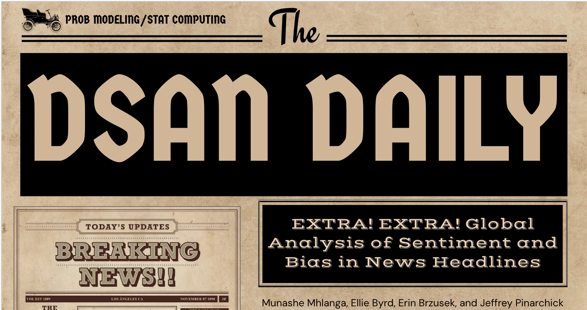

# Global Analysis of Sentiment and Bias in News Headlines
The world changed dramatically during and after the COVID-19 pandemic: dramatic shifts to online platforms, growing distrust of traditional news media, rising reliance on social media, and self-reinforcing negative feedback loops from recommendation algorithms. These changes raise an important research question: how is the news landscape evolving in the U.S. compared with the rest of the world? News headlines are among the most influential aspects of journalism. They shape a reader’s first impressions, guide opinions, and circulate through news recommendation algorithms. Unfortunately, this increasing reliance on headlines has also been exploited to inject or reinforce media biases.

## Literature Review
Media bias refers to the tendency of news articles to favor specific ideologies or perspectives while ignoring or opposing others. It can emerge from subjective journalistic decisions, editorial policies, or broader ideological affiliations and manifests through selective reporting, factual cherry-picking, and emotionally charged content. Media bias shapes not only individual beliefs by filtering information according to specific ideological positions but also societal structures by influencing public trust, political processes, and civic engagement [Ruan et. al, 2025](https://dl.acm.org/doi/pdf/10.1145/3767327). In an increasingly interconnected world, where attention spans are shortened by ‘doom-scrolling’ on platforms such as Facebook, TikTok, and Instagram, understanding these trends is critical. Headlines have become central to capturing audience engagement, as even highly informative articles may fail to reach readers if their titles do not stand out. Furthermore, the amplification of emotionally charged and ideologically biased news is reinforced by recommendation algorithms, creating a feedback loop that favors polarizing content [Bakshy et. al, 2015](https://doi.org/10.1126/science.aaa1160).

## Project Overview
This project was developed collaboratively as part of a team effort with Ellie Byrd, Erin Brzusek, and Jeffrey Pinarchick. My contributions included data engineering and time series modeling.

## Data Collection and Engineering

In this work, our main source of data was news headlines. We used the Babel Briefings dataset, from a data paper published in ACL Anthology [Leeb & Schölkopf, 2024](https://aclanthology.org/2024.naacl-short.55/). The data contained over 4 million news headlines collected using the NewsAPI from 54 locations across the globe, mainly between 2020 and 2021. The data was downloaded through the HuggingFace datasets library in Python, and saved in parquet format on GitHub. We cleaned the dataset to include the news headline text, the publication date, country and source of publication, and category of topic. It is important to note that if the original news article title was in a language other than English, the authors used Google Translate to translate it to English, which produced the title text used in our analysis. We supplemented this data with sentiment and bias variables. 

Sentiment analysis was done in Python using the VADER package, which includes a rule-based sentiment analysis engine that outputs numerical scores detailing how positive, negative, or neutral the statement is, as well as a compound score that ranges from -1 to 1, where -1 is most negative, 0 is neutral, and 1 is most positive [Hutto & Gilbert, 2014](https://github.com/cjhutto/vaderSentiment). Because it was originally trained on social media text, news article snippets, and movie and product reviews, VADER is generally considered a good tool for shorter statements like news headlines.  We also added a sentiment category of “negative,” “neutral,” or “positive” if the compound score is less than or equal to -0.05, between -0.05 and 0.05, and greater than or equal to 0.05 respectively. See Figure 1 for examples of these sentiment variables. 

In our work, bias refers not to statistical bias like sampling bias, measurement bias, or bias of an estimator. It also does not refer specifically to political bias like right-leaning or left leaning, because political spectrums differ across the world. This project instead refers to bias in natural language processing, which describes discriminatory attitudes toward certain groups expressed through toxic or offensive language [Raza et al., 2022](https://doi.org/10.1007/s41060-022-00359-4). A news article classified as “Biased” thus includes words or conveys meaning that is prejudiced. Bias classification on our news headlines was done using a pretrained classifier from the Dbias package in Python (Raza et al., 2022). This classifier was trained on the MBIC Dataset of news article sentences with expert annotations, and built on the DistilBert model. We used it to output a label, either “Biased,” or “Non-Biased,” which we used as the bias category for an article title. The model also outputs a probability that represents how confident the model is in its given label. These probabilities were converted into a continuous bias score variable, ranging from -1 as more confidently non-biased, to 1 as more confidently biased. (See Figure 2 for examples of these bias variables)  Given the computational demands of the Dbias model, we strategically selected seven countries informed by our initial EDA on article volume per country. In addition to using the United States as the primary focus of our analysis, we deliberately included Argentina, Canada, China, Russia, India, and Italy to ensure broad global representation and enable meaningful comparisons across continents. The bias category and scores were calculated only for these seven countries, while the sentiment scores and other data cleaning applied to the entire dataset. These seven countries, therefore, were the focus of our analysis. 

## Key Takeaways

**U.S. news headlines are statistically non-neutral and more negative than global peers.** Hypothesis testing showed that U.S. headlines have a mean sentiment significantly different from zero and consistently more negative than those of other countries, indicating that the U.S. is an outlier in global news sentiment.

**Cross-country sentiment differences shrink within specific news categories.** While countries differ significantly in average sentiment overall, many country–category combinations do not differ significantly, suggesting that article topic can moderate national differences in news framing.

**Positive sentiment is more strongly associated with bias than negative or neutral sentiment.** Chi-square testing revealed a significant association between sentiment and bias, with positively framed headlines more likely to be biased, challenging the assumption that negativity is the primary driver of media bias.

**Article category strongly influences sentiment.** Health and general news articles tend to exhibit more negative sentiment, while sports and entertainment articles skew positive, demonstrating that emotional tone varies systematically by news genre.

**U.S. news sentiment has declined over time and is event-driven, while bias is relatively stable.** Time series analysis shows a downward trend in sentiment aligned with major events such as COVID-19 and political cycles, whereas bias exhibits weaker trends and greater stability, suggesting that emotional tone may play a larger role than ideological slant in shaping media impact.

